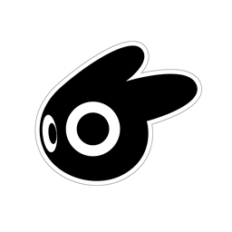

# ZRO2 PromptDock

<p align="center">
  
</p>

<p align="center">
  一个面向 ChatGPT 页面内工作流的提示词侧边工作台扩展。
</p>

<p align="center">
  <a href="https://github.com/tanyuxuan2323-design/ZRO2-PromptDock/releases">
    
  </a>
  <a href="https://github.com/tanyuxuan2323-design/ZRO2-PromptDock/blob/main/LICENSE">
    
  </a>
  <a href="https://github.com/tanyuxuan2323-design/ZRO2-PromptDock/stargazers">
    
  </a>
  <a href="https://github.com/tanyuxuan2323-design/ZRO2-PromptDock/commits/main">
    
  </a>
</p>

<p align="center">
  
  
  
  
</p>

---

## 项目简介

`ZRO2 PromptDock` 是一个浏览器扩展，专门为 `chatgpt.com` 与 `chat.openai.com` 页面内工作流设计。

它把提示词管理、筛选、收藏、复制、填入与追加等操作尽量放在页面内完成，减少在聊天窗口、浏览器弹窗和外部文档之间来回切换的成本。

如果你的日常工作依赖大量固定提示词、角色设定、写作模板或工作流模板，这个项目就是为这种使用方式准备的。

---

## 核心特性

- 页面内悬浮入口，支持展开、收起、拖动
- 面板位置与尺寸可记忆
- 支持新建、编辑、删除、保存提示词
- 支持按标题、内容、标签搜索
- 支持提示词收藏并优先展示
- 支持点击整张卡片快速复制
- 支持一键填入当前 ChatGPT 输入框
- 支持一键追加到当前输入框内容
- 支持标签筛选与标签建议补全
- 支持 JSON 导入、标准 JSON 导出
- 支持本地备份与恢复
- 支持导入时合并去重或整体替换
- 支持窗口位置与尺寸重置

---

## 适用场景

- 频繁在 ChatGPT 中复用固定提示词
- 维护一批常用模板、角色词、任务指令
- 想把提示词管理直接放在聊天页面内完成
- 希望减少复制粘贴和频繁打开扩展弹窗的操作负担

---

## 安装方式

### 方法一：加载本地开发版本

1. 下载或克隆本仓库
2. 如果拿到的是压缩包，先解压
3. 打开 Chrome 或 Edge 的扩展管理页面
4. 开启“开发者模式”
5. 选择“加载已解压的扩展程序”
6. 选择当前项目目录

### 方法二：通过 Release 安装

1. 打开仓库的 [Releases](../../releases)
2. 下载对应版本的发布包
3. 解压后按“加载已解压的扩展程序”方式安装

> 当前仓库以源码管理为主。  
> 如果你是普通使用者，建议优先下载 Release 版本。

---

## 使用说明

1. 打开 `chatgpt.com` 或 `chat.openai.com`
2. 等待扩展在页面中注入悬浮入口
3. 打开 PromptDock 面板
4. 新建、编辑、搜索或筛选你的提示词
5. 点击“填入”或“追加”将内容发送到当前输入框

> 如果“填入 / 追加”没有生效，通常是因为当前页面输入框还没有处于可编辑状态。  
> 先点击一次聊天输入框，再重新操作即可。

---

## 当前版本

- 当前版本：`v2.0.9`
- 扩展清单版本：`Manifest V3`
- 主要平台：`Chrome / Edge`
- 项目状态：`Active`

---

## 项目结构

```text
ZRO2 PromptDock/
|- manifest.json
|- content.js
|- content.css
|- popup.html
|- popup.js
|- popup.css
|- background.js
|- offscreen.html
|- offscreen.js
|- zro2-logo.png
|- CHANGELOG.md
|- LICENSE
```

---

## 开发与更新流程

如果你要继续迭代这个项目，推荐使用下面这套最小工作流：

```bash
git add .
git commit -m "Fix: 描述你的改动"
git push
```

建议在以下情况同步更新版本号：

- `manifest.json` 中的 `version`
- 发布包文件名
- `CHANGELOG.md`
- GitHub Release 标题

---

## 已知说明

- 扩展依赖页面注入，因此目标页面结构变化可能影响按钮或输入框定位
- 不同浏览器对扩展权限提示和开发者模式入口略有差异
- 当页面尚未完全加载时，面板注入可能存在轻微延迟

---

## 路线图

- 持续优化页面内交互体验
- 增强提示词分类与管理能力
- 完善导入导出与备份恢复流程
- 提升对 ChatGPT 页面结构变化的兼容性

---

## 许可证

本项目采用 [MIT License](./LICENSE)。

---

## 作者

Maintainer: `ZRO2`  
GitHub: [tanyuxuan2323-design](https://github.com/tanyuxuan2323-design)

如果这个项目对你有帮助，欢迎 Star。
